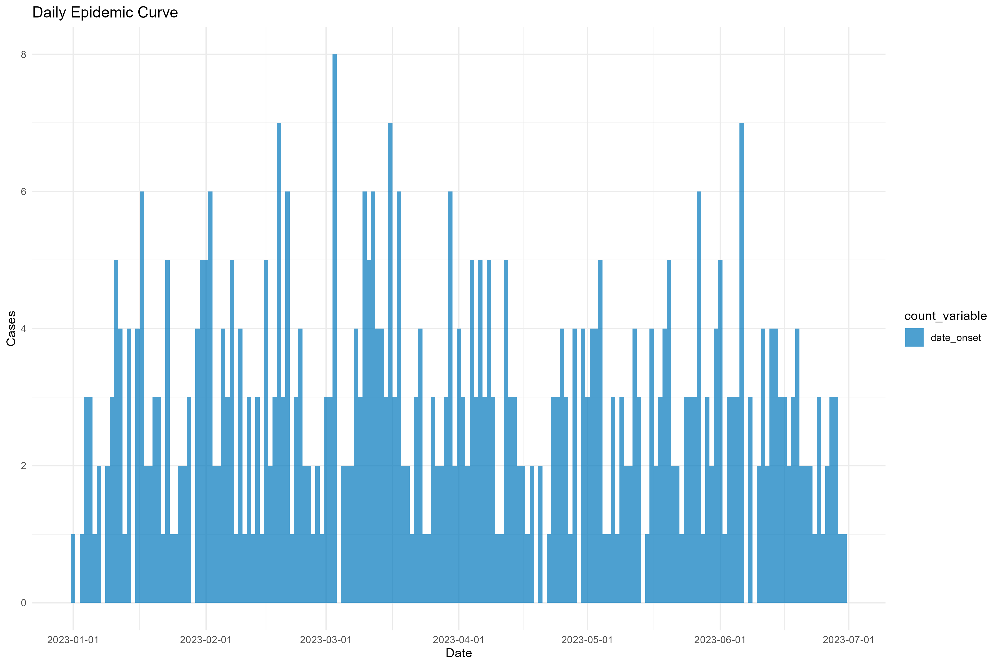
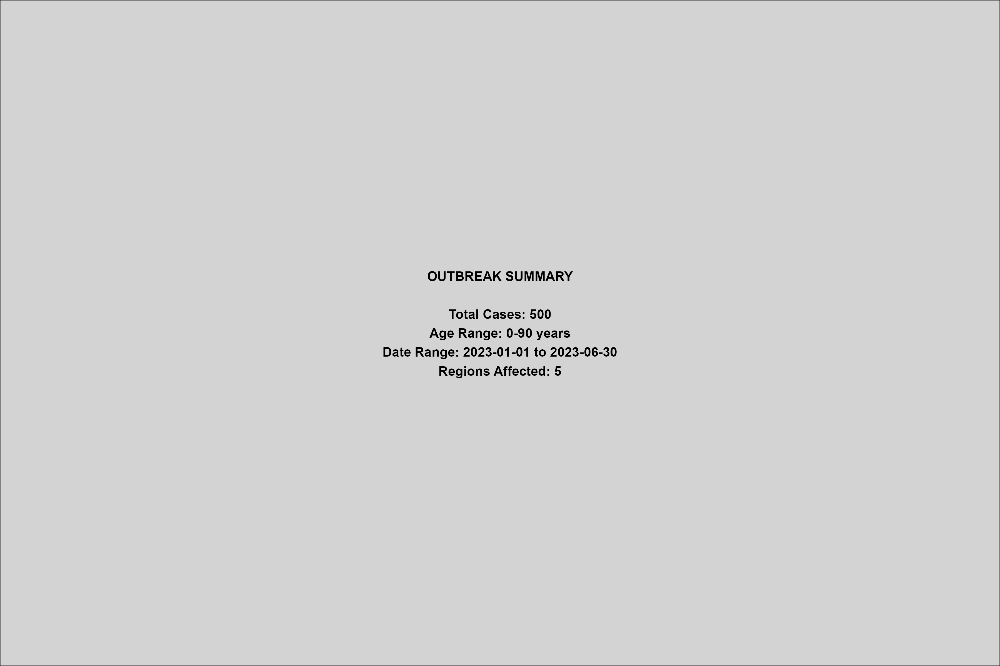

# Outbreak Analytics in R

A comprehensive, production-ready data analysis pipeline for epidemiological outbreak investigation and surveillance using modern R packages.

[](https://www.r-project.org/)
[](https://opensource.org/licenses/MIT)
[](https://GitHub.com/Mwauramos/outbreak-analytics-r/graphs/commit-activity)

## Overview

This project demonstrates a complete outbreak analytics workflow from raw data import through professional visualization. The pipeline handles real-world data quality issues, performs comprehensive validation, and generates publication-ready outputs suitable for epidemiological analysis and public health decision-making.

## Key Features

- **Complete Pipeline**: End-to-end analysis from data import to interactive visualizations
- **Robust Error Handling**: Graceful handling of missing packages and data quality issues
- **Industry Standard**: Uses specialized epidemiological packages (`cleanepi`, `linelist`, `incidence2`)
- **Professional Outputs**: Publication-ready visualizations and comprehensive reports
- **Interactive Elements**: HTML dashboards and searchable data tables
- **Reproducible**: Fully documented with consistent project structure

## Quick Start

### Prerequisites

```r
# Essential packages
install.packages(c("tidyverse", "rio", "here"))

# Recommended epidemiology packages
install.packages(c("cleanepi", "linelist", "incidence2", "janitor"))

# Optional for enhanced features
install.packages(c("plotly", "DT", "patchwork", "scales"))
```

### Usage

1. Clone this repository:
```bash
git clone https://github.com/Mwauramos/outbreak-analytics-r.git
cd outbreak-analytics-r
```

2. Open R/RStudio in the project directory

3. Run the complete pipeline:
```source('scripts/complete_outbreak_pipeline.R')```

4. Check outputs in the `outputs/` directory

## Sample Outputs

### Epidemic Curves


### Demographic Analysis


### Summary Dashboard


## Project Structure

```
outbreak-analytics-r/
├── complete_outbreak_pipeline.R    # Main analysis script
├── data/
│   ├── raw/                        # Raw data files
│   └── processed/                  # Cleaned datasets
├── outputs/
│   ├── plots/                      # Generated visualizations
│   ├── interactive_data_table.html # Searchable case data
│   ├── interactive_epicurve.html   # Interactive epidemic curve
│   └── pipeline_summary.txt        # Analysis summary
├── README.md
└── LICENSE
```

## Pipeline Components

### 1. Data Import & Simulation
- Imports data from CSV, Excel, ZIP files
- Database connectivity (MySQL, PostgreSQL, SQLite)
- Generates realistic outbreak data when real data unavailable
- Comprehensive error handling and validation

### 2. Data Cleaning
- Column name standardization using `cleanepi`
- Duplicate and constant column removal
- Missing value standardization
- Text-to-number conversion (e.g., "twenty" → 20)
- Date standardization and validation

### 3. Data Validation
- Creates validated linelist objects with epidemiological tagging
- Comprehensive quality checks (ID uniqueness, age validity, date ranges)
- Missing data analysis with detailed reporting
- Safeguarding against accidental data loss

### 4. Visualization & Analysis
- Professional epidemic curves (daily, weekly, cumulative)
- Demographic breakdowns (age, gender, geographic)
- Cross-tabulation heatmaps
- Attack rates and epidemiological indicators
- Interactive dashboards and data tables

## Analysis Capabilities

- **Temporal Analysis**: Epidemic curves with peak detection
- **Demographic Analysis**: Age-sex pyramids and distributions  
- **Geographic Analysis**: Regional outbreak patterns
- **Clinical Analysis**: Case status and outcome tracking
- **Quality Assessment**: Missing data patterns and validation metrics

## Technical Specifications

### Core Dependencies
- **R** >= 4.0.0
- **tidyverse**: Data manipulation and visualization
- **rio**: Universal data import/export
- **here**: Reproducible file paths

### Specialized Epidemiology Packages
- **cleanepi**: Epidemic data cleaning and standardization
- **linelist**: Case data validation and tagging
- **incidence2**: Epidemic curve analysis and visualization

### Optional Enhancements
- **plotly**: Interactive visualizations
- **DT**: Interactive data tables
- **patchwork**: Multi-panel figure composition

## Learning Outcomes

This project demonstrates proficiency in:

- **R Programming**: Advanced data manipulation, visualization, and package development
- **Epidemiological Analysis**: Outbreak investigation methodologies and best practices
- **Data Quality Management**: Validation, cleaning, and standardization workflows
- **Reproducible Research**: Project organization, documentation, and version control
- **Public Health Informatics**: Integration of multiple data sources and systems

## Use Cases

- **Outbreak Investigation**: Real-time analysis of disease outbreaks
- **Surveillance Systems**: Routine monitoring of disease patterns
- **Academic Research**: Epidemiological studies and publications
- **Training & Education**: Teaching outbreak analytics methodologies
- **Portfolio Development**: Demonstrating data science capabilities

## Contributing

Contributions are welcome! Please feel free to:

1. Fork the repository
2. Create a feature branch (`git checkout -b feature/enhancement`)
3. Commit changes (`git commit -am 'Add new feature'`)
4. Push to branch (`git push origin feature/enhancement`)
5. Create a Pull Request

## Data Requirements

The pipeline works with standard epidemiological datasets containing:

- **Case identifiers**: Unique case IDs
- **Demographics**: Age, gender/sex
- **Temporal data**: Date of onset, reporting dates
- **Geographic data**: Region, district, coordinates
- **Clinical data**: Case classification, outcomes
- **Laboratory data**: Test results, confirmation status

### Example Data Format
```csv
case_id,age,gender,date_onset,date_sample,status,region
1001,25,female,2023-01-15,2023-01-17,confirmed,North
1002,34,male,2023-01-16,2023-01-18,probable,South
```

## Known Limitations

- Interactive features require additional packages (`plotly`, `DT`)
- Database connectivity depends on appropriate drivers
- Large datasets (>10,000 cases) may require memory optimization
- Some visualizations optimized for outbreaks <2,000 cases

## References

- [Epiverse Initiative](https://data.org/initiatives/epiverse/) - Epidemiological analysis ecosystem
- [R Epidemics Consortium (RECON)](https://www.repidemicsconsortium.org/) - Outbreak analysis tools
- [WHO Outbreak Investigation Guidelines](https://www.who.int/emergencies/outbreak-toolkit)

## License

This project is licensed under the MIT License - see the [LICENSE](LICENSE) file for details.

## Author

**Amos Mwaura**
- Email: [mwauramos.n@gmail.com]

## Acknowledgments

- **Epiverse Initiative** for developing specialized epidemiological R packages
- **R Community** for the robust ecosystem of data analysis tools
- **Public Health Community** for outbreak investigation methodologies and best practices

---

*This project demonstrates advanced R programming, epidemiological analysis, and data science capabilities suitable for public health, research, and data science roles.*
